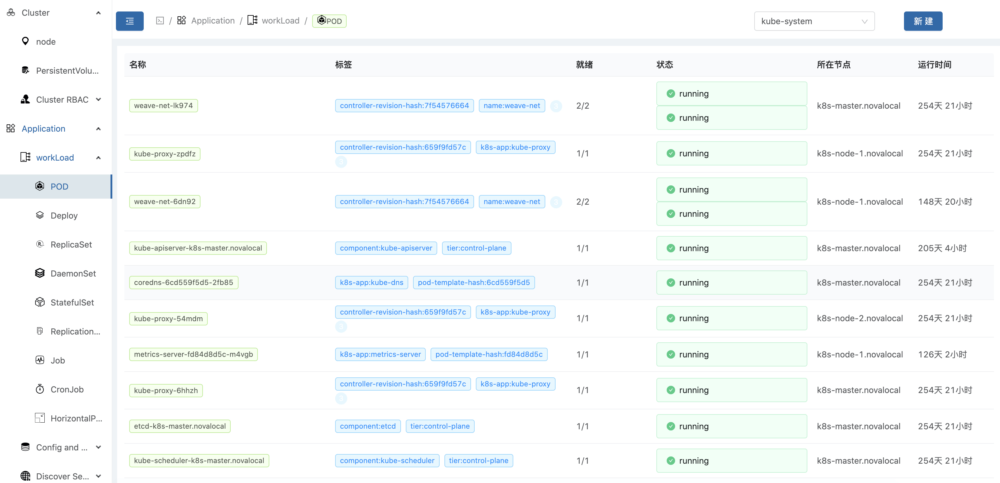
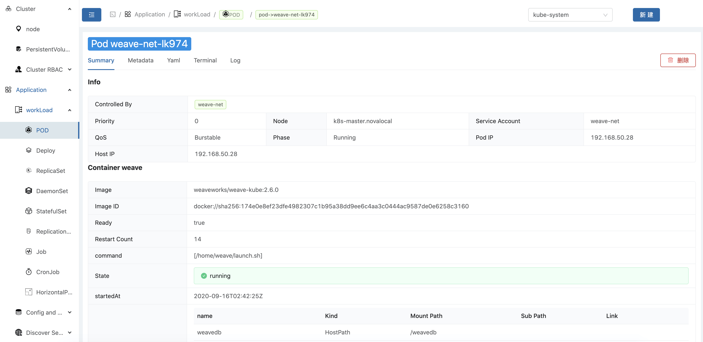
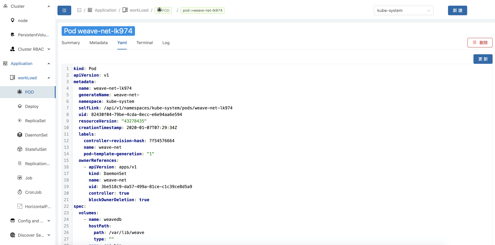

# k8s-ui

## This project is similar to the Kubernetes dashboard. 
This is the front part. The service part is https://github.com/syuyuusyu/k8s4cloud

The front page preview like this: 
***  
  

*****

  

*****  

  

## deployment
### server
```
docker run -d -p 8002:8002 -v  ~/.kube/config:/config --name k8s-svc --restart=always syuyuusyu/k8s-svc:latest
```
Change "~/.kube/config" to your k8s conf file path

***

### front
```
docker run -d -p 3000:3000 -v ~/global.js:/var/www/global.js --name k8s-ui --restart=always syuyuusyu/k8s-ui:latest
```
The global.js use to specific URL for service. By default, The content of global.js like is:
```
window.API = {
    HOST: 'http://127.0.0.1:8002',
}
```
if you deploy on local and visit locally. You don't need special global.js. if you deploy on service, change it with counterpart


